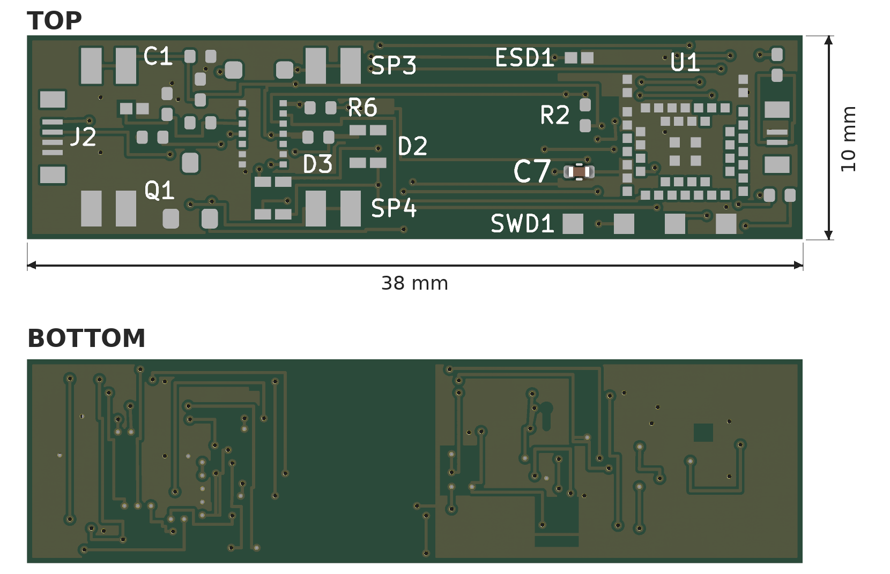
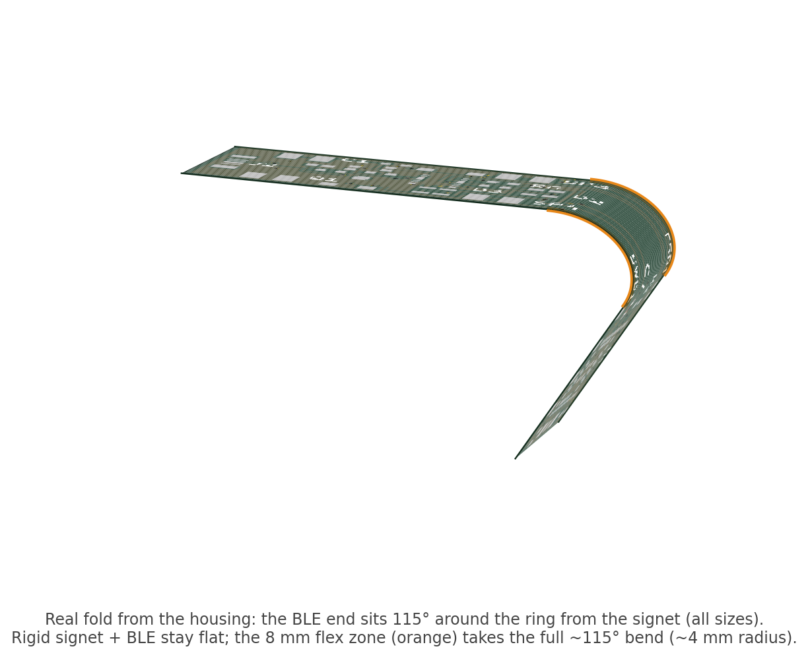

# Swipe Smart Ring — Ring PCB

The main board for a BLE smart ring with IMU-based gesture input and capacitive
touch. This repo contains the **ring board** KiCad project: PCB layout,
schematic, and the custom footprints used by both.



It's small — the board outline is **38 × 10 mm** (about the footprint of a
stick of gum).

The board isn't meant to stay flat. The middle 8 mm is a **flex** section: the
rigid signet and BLE ends fold relative to each other there, so the board follows
the curve of the finger inside the housing. In the housing the BLE end sits
**115°** around the ring from the signet, and the rigid ends stay flat — so the
8 mm flex takes that whole ~115° bend (about a 4 mm radius, well inside the
material's 0.6 mm minimum).



## What this is

A 2-layer **rigid-flex** board that wraps around a finger. It carries a Nordic
nRF52832 BLE SoC, a 6-axis IMU with built-in capacitive (Qvar) touch sensing, a
haptic motor driver, indicator LEDs, and the spring contacts / connectors that
mate with the ring housing.

The board is split into three zones along its length:

```
[ signet  18mm rigid ] —— [ flex 8mm ] —— [ BLE 12mm rigid ]
  battery + motor +                          ANNA-B112 module +
  LED arc + drivers                          antenna keepout + SWD
```

- **Signet** (rigid): battery and motor spring contacts, the two bicolor
  indicator LEDs (light-pipe aligned), the motor MOSFET and flyback diode, and
  the electrode-harness connector.
- **Flex**: the bend region that lets the rigid ends curve around the finger.
- **BLE** (rigid): the ANNA-B112 module with an antenna keepout, plus the SWD
  programming pads and the pogo-harness connector.

## Key components

| Ref | Part | Function |
|-----|------|----------|
| U1  | u-blox **ANNA-B112** (nRF52832) | BLE SoC module, pre-certified, integrated antenna |
| U2  | ST **LSM6DSV16X** | 6-axis IMU + **Qvar** capacitive touch, LGA-14 |
| Q1  | Infineon IRLML6344 | N-ch MOSFET, haptic motor low-side drive |
| D1  | Vishay BAT54W | Schottky motor flyback clamp |
| D2, D3 | American Bright BL-HG0E136J | Bicolor indicator LEDs |
| ESD1/2 | ST ESDALCL5-1BM2 | ESD protection on the Qvar electrode lines |
| J1  | Molex 5034800240 | 2-pin FPC — pogo/charge harness (VBUS, GND) |
| J2  | Molex 5034800440 | 4-pin FPC — electrode harness (Qvar×2, GND×2) |
| SP1–SP4 | KYOCERA AVX 70-9155 | Spring contacts — battery (×2) and motor (×2) |

Full line-item list (passives, MPNs, prices) in [`bom.csv`](bom.csv). The
battery (Seiko MS920SE coin cell) and haptic motor are off-board — they sit in
the housing and contact the spring pads — and are listed at the end of the BOM.

## Design notes

- **No LDO.** VDD = VBAT throughout — the nRF52832 (1.7–3.6 V) runs directly
  off the coin cell (Seiko MS920SE, ~2.0–3.1 V).
- **Motor** runs off the battery rail directly, switched by Q1.
- **Qvar touch** uses the IMU's analog-front-end inputs through 500 Ω series
  resistors, with ESD diodes at the connector.
- **Charging** is resistor-limited from a 5 V pogo input (R3 = 2.2 kΩ →
  ~0.86 mA into the MS920).
- **Layers, not vias.** The fine-pitch parts (ANNA's inner pads, the LSM6DSV16X)
  are fanned out on 2 layers rather than escalating to 4-layer / via-in-pad.

The full product also includes a pogo charge-contact board, a Qvar electrode
flex, and a USB-C dock — those are not part of this repo.

## Opening it

Built with **KiCad 9**. Clone and open `ring.kicad_pro`, or open
`ring.kicad_pcb` / `ring.kicad_sch` directly. Footprints are embedded in the
board, and the `custom.pretty` library is included for editing.

- `ring.kicad_pcb` — routed PCB layout
- `ring.kicad_sch` — schematic
- `ring.kicad_pro` — KiCad project
- `custom.pretty/` — custom footprints
- `bom.csv` — bill of materials for this board
- `ring-schematic.pdf` — schematic as a PDF (no KiCad needed)
- `preview.png` — rendered board, top and bottom, with dimensions
- `preview-3d.png` — 3D view of the rigid-flex fold at the flex zone

## License

MIT — see [LICENSE](LICENSE).
